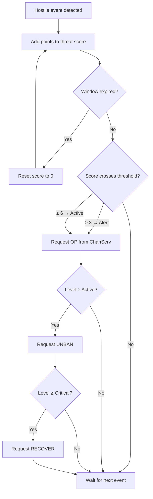
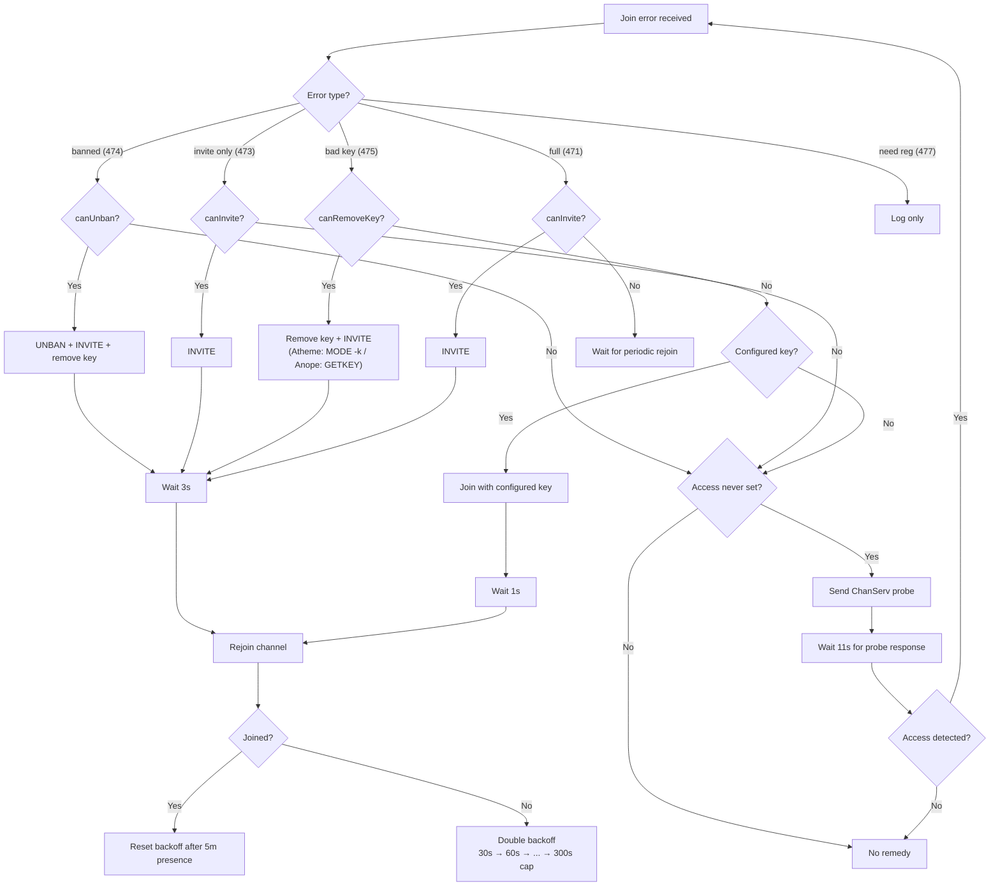
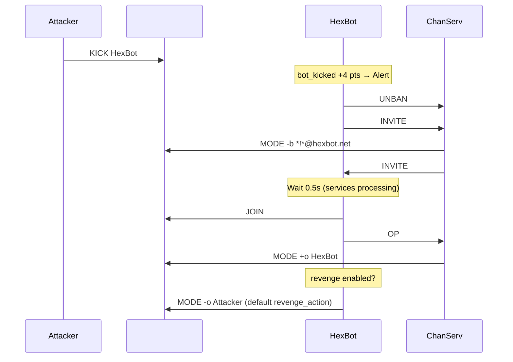
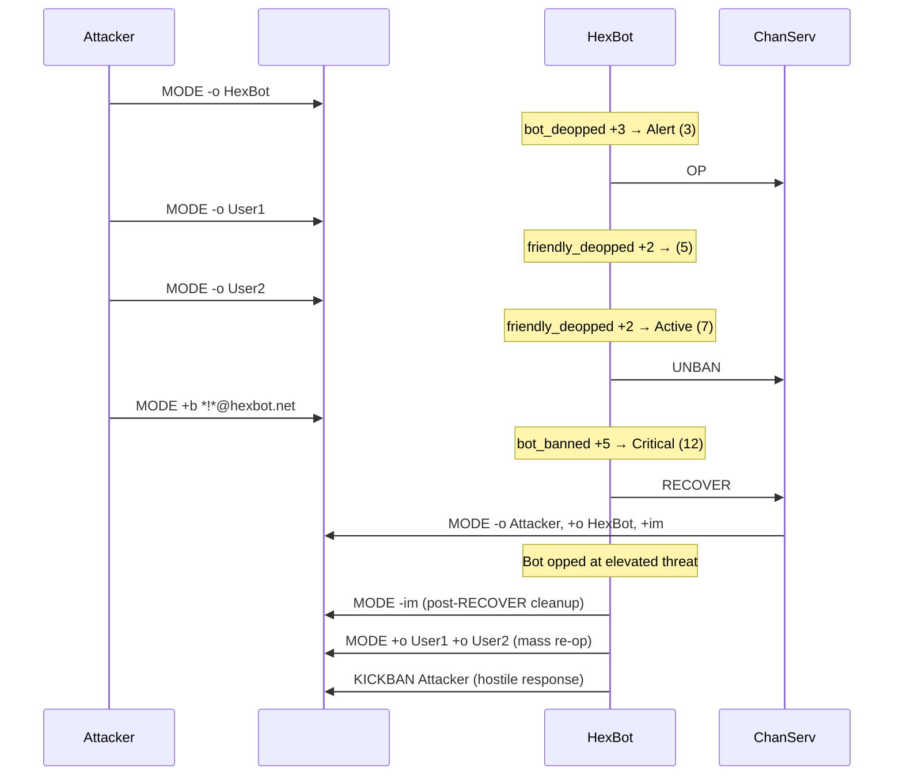

# Channel protection

A practical guide to HexBot's channel protection features: what they do, how they work, and how to configure them.

## Overview

HexBot's channel protection is built around three independent layers:

1. **Passive protection** -- mode enforcement, bitch mode, enforcebans, sticky bans, stopnethack. The bot watches for unauthorized changes and corrects them.
2. **Reactive protection** -- rejoin on kick, revenge, join error recovery. The bot responds to hostile actions aimed at removing it from the channel.
3. **Active protection** -- takeover detection with automatic escalation. The bot scores hostile events in a rolling window and escalates through ChanServ when a coordinated attack is detected.

All three layers are independent and can be enabled separately. Active protection requires ChanServ access to escalate; passive and reactive protection work with direct channel ops alone (though ChanServ access improves recovery).

## How takeover detection works

The takeover detection engine maintains a per-channel rolling threat score. When correlated hostile events accumulate within a short time window, the score crosses thresholds that trigger escalating responses.

### Threat levels

| Level | Name     | Score threshold (default) |
| ----- | -------- | ------------------------- |
| 0     | Normal   | 0                         |
| 1     | Alert    | 3                         |
| 2     | Active   | 6                         |
| 3     | Critical | 10                        |

Thresholds are configurable via `takeover_level_1_threshold`, `takeover_level_2_threshold`, and `takeover_level_3_threshold` in the chanmod plugin config.

### Scored events

| Event                    | Points | Trigger                                                 |
| ------------------------ | ------ | ------------------------------------------------------- |
| `bot_banned`             | 5      | Someone sets +b matching the bot's hostmask             |
| `bot_kicked`             | 4      | Bot is kicked from the channel                          |
| `bot_deopped`            | 3      | Bot is deopped by a non-nodesynch nick                  |
| `friendly_deopped`       | 2      | A flagged user is deopped by a non-nodesynch nick       |
| `unauthorized_op`        | 2      | Someone ops a user who is not flagged (bitch mode)      |
| `enforcement_suppressed` | 2      | Mode enforcement hits the cooldown limit (possible war) |
| `mode_locked`            | 1      | +i, +s, or +k set by a non-nodesynch nick               |

### Rolling window

The engine uses a rolling time window (default 30 seconds, configurable via `takeover_window_ms`). When the window expires without new events, the score resets to zero. This prevents stale events from accumulating across unrelated incidents.

### Escalation actions

When the score crosses a threshold and the threat level increases:

- **Level 1 (Alert)**: Request ops from the first available backend (ChanServ OP).
- **Level 2 (Active)**: Request unban from the backend (the bot may have been banned). At recovery, counter-attack hostile actors from the threat log.
- **Level 3 (Critical)**: Request full channel recovery. On Atheme this sends RECOVER. On Anope this runs a synthetic sequence: MODE CLEAR ops, UNBAN, INVITE, OP.

Escalation only fires on level transitions (crossing upward). If the score is already at level 2 and another event keeps it at level 2, no new escalation occurs.

### Escalation flow



## Recovery features

When the bot regains ops during an elevated threat level (Alert or higher), it performs recovery actions. These are triggered by the bot receiving +o while the threat score is still elevated.

### Mass re-op

When `mass_reop_on_recovery` is enabled, the bot scans the channel and:

- Re-ops all users with op flags who lost their ops (users with `+d` are skipped)
- Re-halfops and re-voices users according to their flags (users with `+d` are skipped for halfop)
- If `bitch` is also enabled, deops anyone who has ops but lacks the required flags (or has `+d`)

This restores the channel to its pre-attack state in a single batch of mode changes.

### Hostile response

At threat level Active (2) or higher, the bot inspects the threat event log and counter-attacks actors responsible for the hostile events. The response level is controlled by the `takeover_punish` channel setting:

- `none` -- no counter-attack
- `deop` -- strip ops from hostile actors
- `kickban` -- kick and ban hostile actors
- `akick` -- add hostile actors to the ChanServ AKICK list (persistent; requires superop+ access)

Actors with exempt flags (default: `n` and `m`) are never counter-attacked.

### Topic recovery

When `protect_topic` is enabled, the bot maintains a snapshot of the channel topic. The snapshot updates during normal operation (threat level 0) and freezes during elevated threat. After recovery, if the current topic differs from the snapshot, the bot restores the pre-attack topic.

### Post-RECOVER cleanup

On Atheme networks, the RECOVER command sets +i and +m on the channel. After the bot is opped following a RECOVER, it automatically removes these modes.

## Passive protection details

### Sticky bans

Bans marked as sticky in the ban store are automatically re-applied if anyone removes them. When a `-b` mode change is seen (not set by the bot itself) and the mask is flagged sticky, the bot immediately re-sets the ban. This prevents attackers from silently removing bans on known bad actors.

### Stopnethack

When a netsplit is detected (a burst of 3+ split-style quits within 5 seconds), the bot enters stopnethack mode and snapshots the current ops in all channels. For a configurable window (`split_timeout_ms`, default 300 seconds), any `+o` grant is checked against the snapshot:

- **Mode 1 (isoptest)**: The target must be in the permissions database with an op flag. Server-opped users without flags are deopped.
- **Mode 2 (wasoptest)**: The target must have held ops before the split. Server-opped users who were not opped pre-split are deopped.

Set `stopnethack_mode` to `0` (default) to disable this feature.

### Channel key and limit enforcement

When `enforce_modes` is enabled, the bot also enforces the configured channel key and user limit:

- `channel_key` -- if set, the bot re-applies the key when it is removed or changed. If empty and someone sets a key, the bot removes it.
- `channel_limit` -- if set to a positive number, the bot re-applies the limit when it is removed or changed. If `0` and someone sets a limit, the bot removes it.

These are separate chanset keys from `channel_modes` and can be configured independently.

## Join error recovery

When the bot cannot join a channel (on startup, reconnect, or after being kicked), the join recovery system handles the error and retries.

### Error handling table

| IRC error              | Recovery strategy                                              |
| ---------------------- | -------------------------------------------------------------- |
| `banned_from_channel`  | UNBAN + INVITE + remove key, then rejoin                       |
| `invite_only_channel`  | INVITE (bypasses +i and +l), then rejoin                       |
| `bad_channel_key`      | Remove key + INVITE, then rejoin; falls back to configured key |
| `channel_is_full`      | INVITE (bypasses +l), then rejoin                              |
| `need_registered_nick` | Log only -- NickServ identification is handled separately      |

### Proactive ChanServ probe

When the bot fails to join a channel and has no known ChanServ access (no `chanserv_access` has been set, manually or via auto-detection), it sends a proactive access probe before giving up. If ChanServ responds with access information, the bot stores the detected tier and retries the recovery with backend assistance.

This means a freshly configured bot that has never joined a channel can still recover from join errors, as long as the bot's nick has ChanServ access to that channel.

### Recovery decision flow



### Exponential backoff

Recovery attempts use exponential backoff to avoid flooding services:

- Initial delay: 30 seconds
- Each attempt doubles the delay: 30s, 60s, 120s, 240s, 300s (capped)
- Maximum delay: 300 seconds (5 minutes)
- Backoff resets after sustained channel presence (5 minutes in the channel without being re-banned)

### Atheme vs Anope differences for key removal

- **Atheme**: Sends `ChanServ MODE #channel -k` to directly remove the key. Works at op access level.
- **Anope**: Sends `ChanServ GETKEY #channel` to retrieve the current key, then joins with it. Works at AOP (level 5) and above. This avoids requiring founder access for MODE CLEAR.

## The ProtectionBackend chain

Channel protection actions are dispatched through a `ProtectionChain` that abstracts over multiple backends. The bot never calls ChanServ directly for protection actions -- it goes through the chain, which selects the best available backend.

### Priority order

Backends are tried in ascending priority order:

1. **Botnet** (priority 1) -- future; inter-bot cooperation for op/deop
2. **ChanServ** (priority 2) -- Atheme or Anope backend, depending on `chanserv_services_type`

The first backend that reports it can handle an action gets the request.

### Capability queries

Each backend exposes capability checks for a given channel:

| Capability     | Description                                               |
| -------------- | --------------------------------------------------------- |
| `canOp`        | Can op the bot or another user                            |
| `canDeop`      | Can deop another user (requires superop on both backends) |
| `canUnban`     | Can remove bans on the bot                                |
| `canInvite`    | Can invite the bot to the channel                         |
| `canRemoveKey` | Can remove or retrieve the channel key                    |
| `canRecover`   | Can perform a full channel recovery (founder only)        |
| `canClearBans` | Can clear all bans (founder only)                         |
| `canAkick`     | Can manage the AKICK list                                 |

### Access tiers

The bot's access level in each channel determines which capabilities are available:

| Tier      | Atheme flags | Anope level | Capabilities                                   |
| --------- | ------------ | ----------- | ---------------------------------------------- |
| `none`    | (no flags)   | < 5         | No backend protection                          |
| `op`      | +o           | 5 (AOP)     | OP, UNBAN, INVITE, key removal, AKICK (Atheme) |
| `superop` | +a / +f / +s | 10 (SOP)    | + DEOP others, AKICK (Anope)                   |
| `founder` | +R / +F      | 10000       | + RECOVER, CLEAR bans                          |

### Auto-detection

On bot join, the chain probes ChanServ to verify the bot's actual access level:

- **Atheme**: Sends `FLAGS #channel <bot_nick>` and parses the flag string response.
- **Anope**: Sends `ACCESS #channel LIST` to find the bot's numeric level, and `INFO #channel` to detect implicit founder status (Anope does not list founders in the access list).

Auto-detected access is synced to channel settings so `.chaninfo` and other commands see the correct value. If a manually configured `chanserv_access` exceeds the actual access, the backend downgrades it and logs a warning.

### Manual override

Set access explicitly with `.chanset`:

```
.chanset #channel chanserv_access founder
```

This overrides auto-detection. Useful when the bot has access but the probe failed, or on networks where probing is unreliable.

## Attack scenarios

### Scenario 1: Simple kick-ban

An attacker with ops kicks and bans the bot.

**What happens:**

1. The kick fires `bot_kicked` (4 points). Threat level jumps to Alert (1).
2. If `chanserv_unban_on_kick` is enabled, the bot immediately requests ChanServ UNBAN.
3. The bot requests ChanServ INVITE (in case the channel is +i).
4. After a short services processing delay, the bot rejoins and requests ChanServ OP.
5. If `revenge` is enabled, the bot deops/kicks/kickbans the attacker after rejoining.

**Sequence:**



**Settings needed:**

```
.chanset #chan chanserv_access op       # or higher
.chanset #chan +chanserv_unban_on_kick  # on by default
.chanset #chan +revenge                 # off by default; needed for counter-attack
```

### Scenario 2: Full lockdown (+b +k +i +l)

An attacker stacks all restrictive modes, kicks the bot, and locks the channel.

**What happens:**

1. The kick triggers `bot_kicked` (4 pts). Mode changes trigger `mode_locked` (+i: 1 pt, +k: 1 pt).
2. The bot requests UNBAN to clear the ban.
3. On Atheme: the bot sends `ChanServ MODE #channel -k` to strip the key (works at op+). On Anope: the bot sends `ChanServ GETKEY #channel` to retrieve the key.
4. The bot requests INVITE (bypasses +i and +l on both services implementations).
5. The bot rejoins and requests OP.

**Settings needed:**

```
.chanset #chan chanserv_access op        # Atheme: op+ for MODE -k
                                         # Anope: AOP+ for GETKEY
.chanset #chan +chanserv_unban_on_kick   # on by default
```

### Scenario 3: Mass deop (takeover attempt)

An attacker deops multiple flagged users and the bot, attempting to seize the channel.

**What happens:**

1. `bot_deopped` fires (3 pts) -- threat level hits Alert (1). Bot requests ChanServ OP.
2. Each `friendly_deopped` adds 2 pts. After two friendly deops, score hits 7+ -- threat level Active (2).
3. At Active, the bot also requests UNBAN (preemptive, in case a ban follows).
4. If the attack continues and score reaches 10+, threat level hits Critical (3). The bot requests RECOVER.
5. On regaining ops: mass re-op restores all flagged users, hostile response punishes attackers, topic is restored if vandalized.

**Sequence:**



**Settings needed:**

```
.chanset #chan chanserv_access op        # op handles everything except RECOVER
                                         # (set to 'founder' only after reading
                                         # the Founder access trade-off section)
.chanset #chan +takeover_detection       # on by default
.chanset #chan +mass_reop_on_recovery    # on by default
.chanset #chan takeover_punish kickban   # default is 'deop'; also: none, akick
```

### Scenario 4: Startup with banned bot

The bot starts up (or reconnects) and is banned from a channel in its config. This can happen after a crash during a takeover, or if someone banned the bot while it was offline.

**What happens:**

1. The bot attempts to join and receives `banned_from_channel`.
2. If no `chanserv_access` is set, the bot sends a proactive ChanServ access probe.
3. If the probe detects access, the bot requests UNBAN + INVITE and retries the join.
4. On success, the bot requests OP and resumes normal operation.

**Settings needed:**

```
.chanset #chan chanserv_access op        # or let auto-detection handle it
```

If `chanserv_access` was never set and the bot has ChanServ access to the channel, auto-detection handles it. If the bot has no ChanServ access, manual intervention is required.

### Scenario 5: Topic vandalism during takeover

An attacker changes the topic as part of a coordinated attack.

**What happens:**

1. The topic snapshot was last updated during normal operation (threat level 0).
2. When the attack begins and threat level rises, the snapshot freezes. Topic changes during elevated threat are treated as vandalism and ignored by the snapshot.
3. After the bot regains ops during elevated threat, it compares the current topic to the frozen snapshot.
4. If they differ, the bot restores the pre-attack topic.

**Settings needed:**

```
.chanset #chan +protect_topic
.chanset #chan +takeover_detection       # on by default
```

## Network-specific configuration

### Atheme networks (Libera Chat, OFTC, Snoonet)

```
chanserv_services_type: "atheme"
```

- ChanServ has a native RECOVER command (requires founder access, +R or +F flag).
- `MODE -k` works at op+ access level for key removal.
- Access detection uses the `FLAGS #channel <nick>` probe.
- Recommended: `chanserv_access op` (handles kick/ban/deop/lockdown recovery).
  Grant founder only after reading the trade-off section above, typically on a
  dedicated non-LLM bot.

### Anope networks (Rizon, DALnet, SwiftIRC)

```
chanserv_services_type: "anope"
```

- No native RECOVER command. The bot synthesizes recovery from: MODE CLEAR ops, UNBAN, INVITE, OP.
- `GETKEY` retrieves the channel key at AOP+ (level 5). This is used instead of MODE -k.
- Access detection uses `ACCESS #channel LIST` for explicit levels and `INFO #channel` to detect implicit founder status (Anope founders are not listed in access lists).
- MODE CLEAR requires founder/QOP (level 10000) for synthetic RECOVER.
- AKICK requires SOP (level 10).
- Recommended: `chanserv_access op` (AOP, level 5) — covers re-op, unban,
  invite, GETKEY, and mass re-op via the bot's own `+o`. Grant founder only
  after reading the trade-off section above, typically on a dedicated non-LLM
  bot.

### EFnet-style networks (no services)

ChanServ is not available. The ChanServ backend returns false for all capability checks.

- Protection relies on passive features: `bitch`, `enforce_modes`, `enforcebans`, stopnethack.
- Takeover detection still works for scoring and logging, but escalation has no backend to call. It will log warnings when it cannot escalate.
- Future: the botnet backend (priority 1) will provide inter-bot op/deop on serviceless networks.

Recommended settings:

```
.chanset #chan +bitch
.chanset #chan +enforce_modes
.chanset #chan channel_modes +nt
.chanset #chan +enforcebans
```

Stopnethack is configured globally in `plugins.json`, not per-channel:

```json
"stopnethack_mode": 2
```

## Recommended settings

**The recommended default is `chanserv_access op` (AOP on Anope), not founder.**
Founder access lets the bot execute commands — DROP, SET FOUNDER, FLAGS wipe,
permanent AKICK on the human owner — that are **not recoverable** without
services-staff intervention if the bot's nick is ever compromised. See
[Founder access and bot-nick compromise](#founder-access-and-bot-nick-compromise)
below for the full trade-off. Op / AOP covers every attack scenario documented
in this file except the single-command `RECOVER` shortcut.

### Minimal protection

Any network with ChanServ. Both `takeover_detection` and `chanserv_unban_on_kick` are on by default, so only the access tier needs to be set.

```
.chanset #chan chanserv_access op
```

### Standard protection

Adds mode enforcement, ban-on-kick recovery, and topic protection. `takeover_detection` and `chanserv_unban_on_kick` are on by default but shown here for clarity.

```
.chanset #chan chanserv_access op
.chanset #chan +takeover_detection       # on by default
.chanset #chan +enforce_modes
.chanset #chan channel_modes +nt
.chanset #chan +chanserv_unban_on_kick   # on by default
.chanset #chan +protect_topic
```

### Maximum protection

Enables all defensive features at the ops tier. Suitable for high-value
channels on networks where the bot has ChanServ op / AOP access (the
recommended tier). Settings that are on by default are annotated but included
for completeness.

```
.chanset #chan chanserv_access op
.chanset #chan +takeover_detection       # on by default
.chanset #chan +enforce_modes
.chanset #chan channel_modes +nt
.chanset #chan +chanserv_unban_on_kick   # on by default
.chanset #chan +protect_topic
.chanset #chan +mass_reop_on_recovery    # on by default
.chanset #chan +bitch
.chanset #chan +protect_ops
.chanset #chan +enforcebans
.chanset #chan +revenge
.chanset #chan takeover_punish kickban   # default is 'deop'
```

### Founder-tier protection (opt-in, advanced)

Grant founder only after reading the trade-off section below. With founder,
chanmod unlocks native RECOVER (Atheme) and synthetic MODE CLEAR (Anope) for
the worst-case takeover scenario.

```
.chanset #chan chanserv_access founder
```

If you run this bot with ai-chat (or any other LLM-driven plugin) loaded, do
not grant founder on channels where those plugins are active — see
[`plugins/ai-chat/README.md`](../plugins/ai-chat/README.md) for the reasoning
and the `disable_when_founder` escape hatch.

## Founder access and bot-nick compromise

Granting the bot ChanServ founder access is qualitatively different from
granting op / AOP. The extra capabilities are small; the extra blast radius
from compromise is large.

### What founder adds

- **Atheme `RECOVER` / Anope synthetic `MODE CLEAR`** — one-shot takeover
  reversal. With op / AOP, the bot gets the same end state via ChanServ `OP`
  - its own `+o` re-op sequence; just a few steps slower.
- **`canClearBans`** — mass ban wipe. With op, the bot can still remove bans
  one at a time via `MODE -b`.

### What founder risks (unrecoverable without services staff)

- **`DROP #channel`** — deregisters the channel entirely. All access lists,
  AKICKs, metadata, and founder records are gone.
- **`SET #channel FOUNDER <nick>`** — transfers founder to someone else. If
  the new founder doesn't co-operate, you've lost the channel.
- **`FLAGS #channel * -*`** (Atheme) / access-list wipe (Anope) — every
  trusted user loses their access in a single command.
- **`AKICK` on the human owner** — permanently locks the real founder out.

### Why this matters

The bot is software running on a machine you administer. Its nick is protected
by a NickServ password (and ideally SASL). Any of the following turns founder
access into a channel-destroying incident:

- NickServ password leak or SASL key theft
- Nick hijack during a services outage
- Prompt injection in an LLM-driven plugin (ai-chat, etc.)
- A plugin bug that passes untrusted input to `raw()` or writes a fantasy
  command to a channel the bot is in
- An unpatched remote code execution on the bot host

At op / AOP, the worst case is a kick/ban/deop round trip — noisy, but you
recover in minutes. At founder, the worst case is a channel you no longer own.

### Recommendation

- **Default to op (Atheme) / AOP (Anope) on every channel.** This is now the
  documented recommendation across Minimal, Standard, and Maximum protection.
- **Keep the human owner as founder.** A bot does not need to be on the
  access list as founder to be opped, unbanned, invited, or have keys
  removed.
- **If you need `RECOVER`**, either accept the trade-off for that channel, or
  run a two-bot topology: an unprivileged AI / user-facing bot plus a
  separate chanmod-only bot with founder access and no LLM or DCC surfaces.
- **ai-chat** ships with a `disable_when_founder` gate (on by default) that
  refuses to respond in any channel where the bot's `chanserv_access` chanset
  reads `founder`. This is an enforcement backstop, not a substitute for
  choosing op / AOP in the first place.

## Troubleshooting

**Bot does not rejoin after being banned**
The `chanserv_access` channel setting is not set (or is set to `none`). The bot has no way to ask ChanServ for help. Set it to the bot's actual access tier, or let auto-detection run by ensuring the bot's nick has ChanServ access to the channel.

**Takeover detection fires but nothing happens**
The `chanserv_access` is `none` or the bot has no backend that can handle the escalation. Check `.chaninfo` to see the effective access level. If it shows `none`, set it manually or verify the bot's ChanServ flags/access list entry.

**Bot keeps trying to join with the wrong key**
The channel key in `bot.json` does not match the current key. Update the key in the config, or if the bot has ChanServ access, the join recovery system will use GETKEY (Anope) or MODE -k (Atheme) to handle it.

**RECOVER fails on Anope**
Synthetic RECOVER requires founder access (QOP / level 10000). SOP (level 10) is not enough for MODE CLEAR. Verify the bot is the channel founder or has QOP access.

**Mass re-op did not happen after recovery**
Either `mass_reop_on_recovery` was turned off (it is on by default), or the bot was not opped during elevated threat (the threat window expired before ops were regained). Check that `takeover_window_ms` is long enough for the recovery sequence to complete.

**Topic was not restored after attack**
Either `protect_topic` is not enabled, or no topic snapshot existed (the bot had not seen a topic change at threat level 0 since it joined the channel). The bot must observe the topic during normal operation to create a snapshot.
